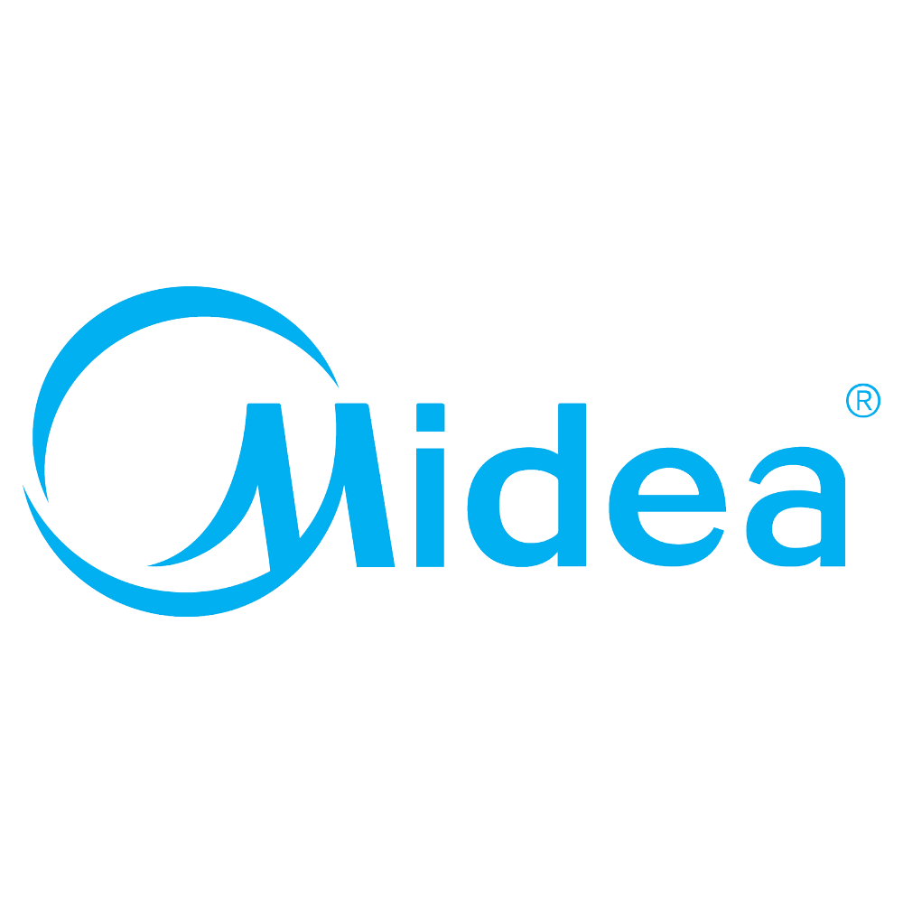
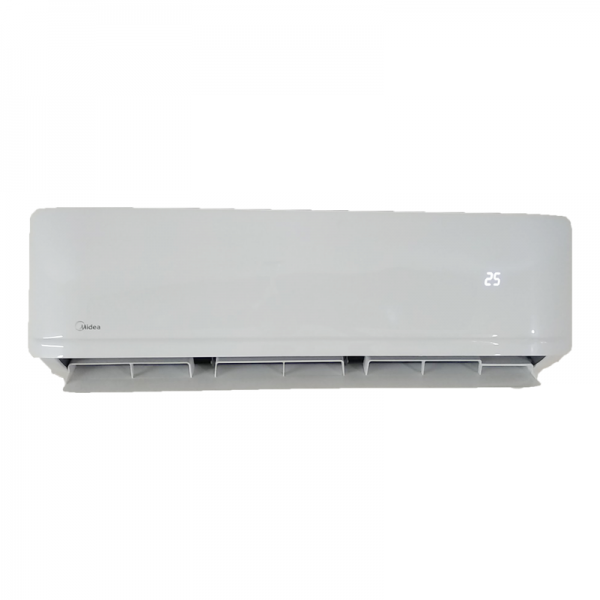
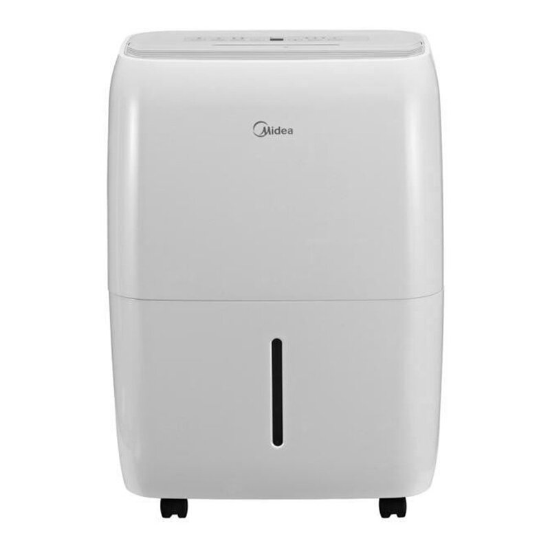

<p ALIGN="CENTER">


</p>

<SPAN ALIGN="CENTER">

# Homebridge Midea Lan

<!-- [](https://www.npmjs.com/package/homebridge-midea-lan) -->
<!-- [](https://www.npmjs.com/package/homebridge-midea-lan)<br> -->
<!-- [](https://discord.gg/WE4eqqjZ)<br> -->

<!-- [](https://github.com/homebridge/homebridge/wiki/Verified-Plugins) -->

## [Homebridge](https://github.com/homebridge/homebridge) plugin for accessing Midea air conditioners and dehumidifiers via local network.

 &nbsp;


## Requirements

 &nbsp;
 &nbsp;

<SPAN ALIGN="Left">

## Notes
*Unofficial* plugin for Midea dehumidifier.  I wrote this plugin because I own one of the Midea "cube" dehumidifiers and wanted to integrate it with Apple Home. I found [homebridge-midea-lan](https://github.com/hillaliy/homebridge-midea-lan) written by [Yossi Hillali](https://github.com/hillaliy) but discovered that it did not work. I decided to fork that and get it working.  That turned out to be a larger project than I anticipated, but this is the end result.

While I built this to support the dehumidifier, I retained all the code that supports air conditioners, updating it as necessary.  I believe therefore that Midea ACs should work as well.

Pull requests and/or other offers of development assistance gratefully received.

## Installation

⚠️ Before installing this plugin you must install [midea-beautiful-air](https://github.com/nbogojevic/midea-beautiful-air) globaly using pip (pip install --upgrade midea-beautiful-air).

**Not publshed to NPM yet...***

**Option 1: Install via Homebridge Config UI X:**

Search for "midea-lan" in [homebridge-config-ui-x](https://github.com/oznu/homebridge-config-ui-x) and install `@dkerr64/homebridge-midea-lan`.

**Option 2: Manually Install:**

```text
sudo npm install -g @dkerr64/homebridge-midea-lan
```

Use of **Homebridge [child bridge](https://github.com/homebridge/homebridge/wiki/Child-Bridges)** is strongly encouraged to improve overall responsiveness of Homebridge and Apple Home.

## Configuration

### Homebridge Config UI X

**Not implemented yet...**
[Homebridge Config UI X](https://github.com/oznu/homebridge-config-ui-x) is the easiest way to configure this plugin.

### Configuration File

```json
"platforms": [
    {
        "name": "Midea-Lan",
        "platform": "midea-lan",
        "user": "MIDEA_ACCOUNT_EMAIL",
        "password": "MIDEA_PASSWORD",
        "appCredentials": "NetHomePlus",
        "interval": 30,
        "broadcastRetry": 2,
        "broadcastTimeout": 2,
        "useDeviceList": true,
        "devices": [
            {
                "deviceId": "1234567890",
                "config": {
                    "name": "Dehumidifier",
                    "ip": "192.168.xx.yy",
                    "token": "505792...BF0174607CD9",
                    "key": "b3d8936...799279",
                    "type": 161
                }
            }
        ]
    }
]
```
* **Platform Properties**
  * **name** *(required)*: Platform name, set to 'Midea-Lan'.
  * **platform** *(required)*: Platform identifier, set to 'Midea-Lan'.
  * **user** *(optional)*: Your Midea account email address, that you use to login with the Midea mobile app. This is *required* the first time you run the plugin, or if you add new Midea devices to your LAN.  It is *optional* if you know the device *token/key* pair and list it in the **devices** array, or have run the plugin once as the *token/key* pair for all discovered devices will be stored in the Homebridge Accessory Cache. **Note:** if you delete the device from accessory cache then you need the *user/password* to re-discover the device (unless you list it in the **devices** array, see below).
  * **password** *(optional)*: Your Midea account password.  See comments above on whether required.
  * **appCredentials** *(optional)*: This identifies the Midea app for which the *user/password* pair are used. Defaults to *NetHomePlus*, which is the only one I have tested.  Alternatives are *MideaAir* and *MSmartHome* but these are not tested.
  * **interval** *(optional)*: Time interval in seconds that the plugin will poll devices for change in status.  Defaults to *30* seconds.
  * **broadcastRetry** *(optional)*: Number of times to attempt to discover Midea devices on LAN. Defaults to *2*.
  * **broadcastTimeout** *(optional)*: Time interval in seconds between LAN broadcast during device discovery.  Defaults to *2* seconds.
  * **useDeviceList** *(optional)*: If set to *true* then all Midea devices must be listed in the *devices* array. In addition you can omit the *user/password/appCredentials* fields as these will not be used.  All network traffic remains within your local area network (LAN) and will not interact with any Midea servers on the internet.
* **devices** is an array of objects that allow settings on a device-by-device basis. This array is optional but if provided contains the following fields, all of which are *required* and presumed to be correct.

    You can obtain the values for these fields by running the plugin at least once with *useDeviceList* set to *false* and monitoring the Homebridge log.  During plugin initialization you will see all these values printed out in a format that you can copy/paste into the config file.  You must have set *user/password* and the plugin will query Midea servers on the internet to obtain the *token/key* values.
  * **deviceId** *(required)*: ID to identify specific device.
  * **config** *(required)*: Object with settings specific for this device:
    * **name** *(required)*: Override the name provided by Midea for the device, this is what is shown in the Homebridge UI accessories page.
    * **ip** *(required)*: IPv4 address of the Midea device on your LAN.
    * **token** *(required)*: Device login token, obtained from the Midea server.
    * **key** *(required)*: Device login key, obtained from the Midea server.
    * **type** *(required)*: Must be either the number 161 (dehumidifier) or 172 (air conditioner).

### Supported Devices

This plugin should support Midea dehumidifiers and air conditioners listed at [midea-beautiful-air](https://github.com/nbogojevic/midea-beautiful-air), however I have not tested it on anything other than the one dehumidifier I own.

### Temperature Display Units

**Not tested...** This Plugin support Celsius & Fahrenheit (You can set the Default unit on Homebridge config).
Display Units can set in HomeKit app, device settings.
`This is just to control the temperature unit of the AC's display. The target temperature setter always expects a celsius temperature (resolution of 0.5C), as does the midea API`

### Rotation Speed and Swing
**Not tested...**
Rotation Speed and Swing mode can set in the HomeKit app, device settings.
Rotation Speed values are:
| Air Conditioner | Dehumidifier |
| --- | --- |
| 0% Device Off | 0% Device Off |
| 25% Low | 30% Silent |
| 50% Middle | 60% Medium |
| 75% High | 100% High |
| 100% Auto | ... |

### Dehumidifier Relative Humidity

Previous versions of this plugin mapped Apple Home relative humidity range of 0% to 100% to the min/max range supported by Midea humidifiers of 35% to 85%, this resulted in poor user experience as the relative himidity set/shown in Apple Home did not match that shown on the dehumidifier.  This version of the plugin fixes that.  Note that if the user attempts to set a humidity outside of the supported range, then it is forced to the minimum (or maximum) permitted value... so Apple Home will never show a target relative humidity below 35% or above 85%.

## Technical Notes

As the plugin name suggests, every attempt is made to communicate directly over your local area network (LAN) to the Midea device without accessing a Midea server over the internet.  However, the only way to obtain *token/key* pairs for a device is to conect to the Midea servers.  But after that is done once, it is not done again unless there is a change in Midea devices connected to your LAN.

### Device discovery

The plugin will send a broadcast packet to all network interfaces on your Homebridge server to discover Midea devices.  Therefore your devices must be on the same LAN subnet(s) as your Homebridge server.

If the list of devices returned matches what was previously discovered then the *token/key* pairs previously discovered are reused.  If a new device is added to your LAN then the discovery process is repeated using the *user/password* to connect to Midea servers to obtain a new set of *token/key* pairs for each device.

### Known issues

I have observed in the Homebridge log error messages **Error retrieving device state:** which usually includes detailed trace back that states that a network timeout occurred when attempting to get details from Midea devices.  This may indicate that the device is offline.  I continue to investigate this.

## Credits

This plugin would not have been possible without [homebridge-midea-lan](https://github.com/hillaliy/homebridge-midea-lan), [midea-beautiful-air](https://github.com/nbogojevic/midea-beautiful-air) and [ioBroker.midea](https://github.com/TA2k/ioBroker.midea).

## License

(c) Copyright 2023 David A. Kerr

Licensed under the Apache License, Version 2.0 (the "License"); you may not use this program except in compliance with the License. You may obtain a copy of the License at [http://www.apache.org/licenses/LICENSE-2.0](http://www.apache.org/licenses/LICENSE-2.0)

Unless required by applicable law or agreed to in writing, software distributed under the License is distributed on an "AS IS" BASIS, WITHOUT WARRANTIES OR CONDITIONS OF ANY KIND, either express or implied. See the License for the specific language governing permissions and limitations under the License.

### Trademarks

Apple and HomeKit are registered trademarks of Apple Inc.
